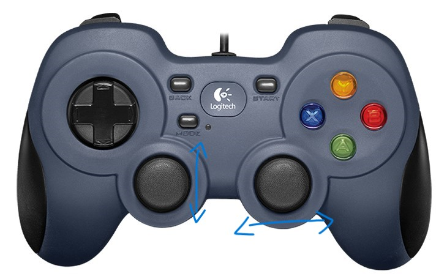
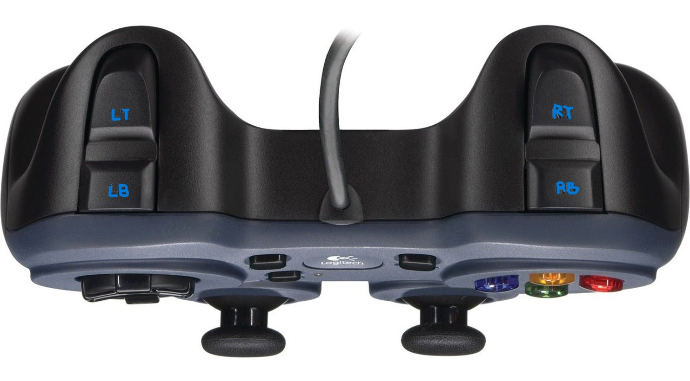

# bootcamp 2024 fgc vietnam
Đây là layout của Controller

## Các nút bấm được sử dụng
- Joystick left: tiến/lùi
- Joystick right: quay trái/phải
- A: nâng bot lên
- B: hạ bot xuống
- Start: quay servo làm bật thanh linear lên
- Back: reset servo bật linear
### Các nút nhấn thêm trong từng idea
#### Idea 1:
- X: quay linear sang phải
- Y: quay linear sang trái
#### Idea 3:
- LB: quay servo hạ 2 thanh xuống
- RB: reset servo hạ 2 thanh
- LT: quay gripper xuống
- RT: quay gripper lên